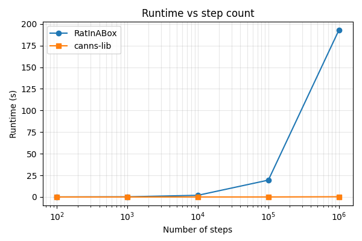
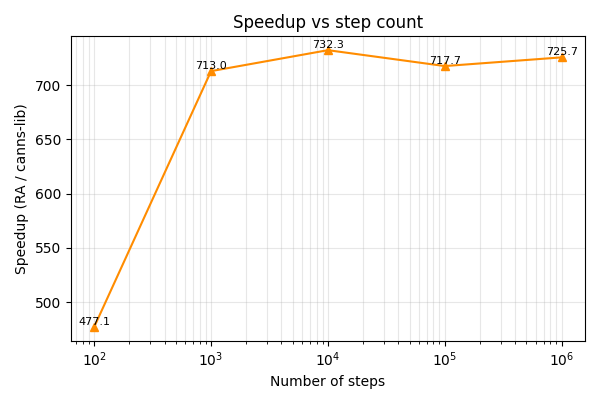

# canns-lib

[](https://github.com/Routhleck/canns-lib/actions)
[](https://badge.fury.io/py/canns-lib)
[](https://opensource.org/licenses/Apache-2.0)
[](https://github.com/routhleck/canns-lib)

[](https://github.com/routhleck/canns-lib)

<picture></picture>
<picture></picture>
[](https://doi.org/10.5281/zenodo.17465788)
[](https://arxiv.org/abs/2606.27783)

<picture></picture>
[](https://pepy.tech/projects/canns-lib)
[](https://deepwiki.com/Routhleck/canns-lib)
[](https://buymeacoffee.com/forrestcai6)

High-performance computational acceleration library for [CANNs](https://github.com/Routhleck/canns) (Continuous Attractor Neural Networks), providing optimized Rust implementations for computationally intensive tasks in neuroscience and topological data analysis.

## Overview

canns-lib is a modular library designed to provide high-performance computational backends for the CANNS Python package. It currently includes the Ripser module for topological data analysis, with plans for additional modules covering approximate nearest neighbors, dynamics computation, and other performance-critical operations.

## Modules

### 🔬 Ripser - Topological Data Analysis

High-performance implementation of the Ripser algorithm for computing
Vietoris-Rips persistence barcodes. Drop-in replacement for `ripser.py`
with identical output (verified at the level of bar counts **and** per-
dimension birth/death values on dense and sparse inputs).

#### Performance vs `ripser.py` (v0.9.0)

Measured by `benchmarks/ripser/comprehensive_benchmark.py --fast` (24
dense point-cloud tests, n ∈ {50, 100, 150, 300}, maxdim ∈ {1, 2},
categories: circle, sphere, torus, random, clusters, grid, swiss_roll,
moons, circles). Cross-validated on **macOS arm64** and **Linux x86_64
(16-core A100 server, `RAYON_NUM_THREADS=16`)**.

| Platform                       | maxdim=1 | maxdim=2 | overall median |
|------------------------------- |---------:|---------:|---------------:|
| **Linux x86_64 / 16 cores**     | **0.97×** | **1.58×** | **1.30×** |
| macOS arm64 (single benchmark) | 0.63×    | 1.10×    | 0.79×          |

Headline Linux maxdim=2 result: peak **1.91×** on torus n=300. Per-dimension
persistence values match `ripser.py` exactly on both platforms
(`counts_match=True | birth/death values match=True`).

#### Performance vs `ripser.py` (v0.8.0 baseline, before this release)

Same harness, same matrices:

| Platform                       | v0.8.0 maxdim=1 | v0.8.0 maxdim=2 | v0.8.0 overall | v0.9.0 deltas                          |
|------------------------------- |----------------:|----------------:|--------------:|----------------------------------------:|
| Linux x86_64 / 16 cores        | 0.97×           | 1.03×           | 1.03×         | maxdim=2 **+0.55×**                  |
| macOS arm64 (single benchmark) | 0.51×           | 0.98×           | 0.70×         | overall +0.09×, maxdim=2 +0.12×       |

#### Shuffle null models with explicit parameters

`canns_lib.ripser.shuffle_null_model` independently circular-shifts each
feature column, computes distances between rows, and runs Ripser. Its metric
and persistence options are explicit:

```python
from canns_lib.ripser import ripser, shuffle_null_model

# X has shape (timepoints, features).
real = ripser(X, metric="cosine", maxdim=2, coeff=47)
null = shuffle_null_model(
    X,
    num_shuffles=100,
    metric="cosine",
    maxdim=2,
    coeff=47,
    seed=17,
)
```

This generic feature-space null does **not** perform the complete ASA
analysis. The companion [CANNs PR #103](https://github.com/Routhleck/canns/pull/103)
keeps activity selection, standardization, PCA, density selection and graph
construction in CANNs, configured through `TDAConfig` and rerun each round.
Do not substitute a shuffle of an already processed point cloud for that
full workflow. Independent column shifts also do not define a valid null
for a precomputed distance matrix, so `distance_matrix=True` is rejected.

Explicit `shifts` support exact replay; `generate_offsets` exposes the same
offset generation for application workflows. `max_workers=1` is the default,
with bounded thread concurrency available. Failed rounds raise with replay
information instead of contributing zero or disappearing from the null.

The default result is a per-dimension list of maximum **finite** lifetimes.
`return_details=True` also returns shifts, essential-class counts and complete
diagrams. Finite maxima alone do not test essential classes.

The previous private `_ripser_core.shuffle_null_model` computed a different
neuron-distance null and has been removed; calls now raise a migration error.
Its timing ratios against the full ASA workflow were not measurements of the
same analysis and are no longer presented as acceleration results. Downstream
ASA callers must use the coordinated CANNs update.

The public Rust `fuzzy_union` kernel can be used within that pipeline to build
an owned dense float64 adjacency matrix without fixing its scientific
parameters. See [the shuffle API, migration and kernel guide](docs/shuffle.md)
for contracts, memory costs and examples. The generic shuffle API alone does
not establish agreement with the ASA workflow or any paper.

#### Features

- **Algorithmic improvements**: Row-by-row edge generation, cleared
  coboundary enumeration
- **Memory optimization**: Structure-of-Arrays reduction matrix,
  k-major binomial coefficient table, packed `(index, coefficient)`
  `EntryT` (24 → 16 bytes), GAT-based static-dispatch cofacet
  enumeration with inline simplex-vertex stack array
- **Parallel processing**: Multi-threading with Rayon (enabled by default)
- **Full Compatibility**: Drop-in replacement for `ripser.py` with identical API
- **Multiple Metrics**: Support for Euclidean, Manhattan, Cosine, and custom distance metrics
- **Sparse Matrices**: Efficient handling of sparse distance matrices
- **Cocycle Computation**: Optional computation of representative cocycles
- **Configurable feature-space shuffle**: explicit metric and persistence
  parameters, reproducible per-feature shifts, bounded concurrency and
  explicit failures; optional Rust `fuzzy_union` for dense adjacency construction
  ([API guide](docs/shuffle.md))

Two experimental paths are kept under env-flag opt-in only:
`CANNS_RIPSER_USE_LOCKFREE=1` and `CANNS_RIPSER_APPARENT=1`. Both are
correctness-fixed and match `ripser.py` outputs but are currently net-
slower than sequential on this codebase.

### 🧭 Spatial Navigation (RatInABox parity)

Accelerated reimplementation of RatInABox environments and agents with PyO3/
Rust. Supports solid and periodic boundaries, arbitrary polygons, holes, and
thigmotaxis wall-following.

#### Performance Snapshot

The spatial backend delivers ~700× runtime speedups vs. the pure-Python
reference when integrating long trajectories.  Benchmarked with
`benchmarks/spatial/step_scaling_benchmark.py` (`dt=0.02`, repeats=1).

| Steps | RatInABox Runtime | canns-lib Runtime | Speedup |
|------:|------------------:|------------------:|--------:|
| 10²   | 0.020 s | <0.001 s | 477× |
| 10³   | 0.190 s | <0.001 s | 713× |
| 10⁴   | 1.928 s | 0.003 s | 732× |
| 10⁵   | 19.481 s | 0.027 s | 718× |
| 10⁶   | 192.775 s | 0.266 s | 726× |





Plots and CSV summaries are emitted to `benchmarks/spatial/outputs/`.

#### Highlights

- **Full parity** with RatInABox API (Environment, Agent, trajectory import/export)
- **Polygon & hole support** with adaptive projection and wall vectors
- **Parity comparison tools** in `example/trajectory_comparison.py`
- **Visualization utilities**: drop-in replacements for RatInABox's plotting
  helpers (trajectory, heatmaps, histograms)
- **Benchmark scripts** for long-step drift and speedup under
  `benchmarks/spatial/`

#### Visualization Helpers

```python
from canns_lib import spatial

env = spatial.Environment(dimensionality="2D", boundary_conditions="solid")
agent = spatial.Agent(env, rng_seed=2025)

for _ in range(2_000):
    agent.update(dt=0.02)

# Trajectory with RatInABox-style colour fading and agent marker
agent.plot_trajectory(color="changing", colorbar=True)

# Other helpers mirror RatInABox naming
agent.plot_position_heatmap()
agent.plot_histogram_of_speeds()
agent.plot_histogram_of_rotational_velocities()
```

See `example/spatial_plotting_demo.py` for a full script that produces the
trajectory, heatmap, and histogram figures showcased above.

#### Drift Velocity Control

Guide agent movement toward target directions while maintaining natural stochastic motion (matches RatInABox API):

```python
# Basic drift usage
agent.update(
    dt=0.02,
    drift_velocity=[0.05, 0.02],  # Target velocity vector
    drift_to_random_strength_ratio=5.0  # Drift strength relative to random motion
)
```

**Parameters**:
- `drift_velocity`: Target velocity vector (must match environment dimensionality)
- `drift_to_random_strength_ratio`: Controls balance between drift and randomness
  - `0.0` = pure random motion (no drift)
  - `1.0` = equal weighting (default)
  - `> 1.0` = stronger drift toward target

**Use cases**: Goal-directed navigation, reinforcement learning, biased exploration.

See `example/drift_velocity_demo.py` for detailed examples with visualizations.

### 🚀 Coming Soon

- **Dynamics**: High-performance dynamics computation for neural networks
- And more...

## Installation

### From PyPI (Recommended)
```bash
pip install canns-lib
```

### From Source
```bash
git clone https://github.com/Routhleck/canns-lib.git
cd canns-lib
pip install maturin
maturin develop --release
```

## Quick Start

### Using the Ripser Module

```python
import numpy as np
from canns_lib.ripser import ripser

# Generate sample data
data = np.random.rand(100, 3)

# Compute persistence diagrams
result = ripser(data, maxdim=2)
diagrams = result['dgms']

print(f"H0: {len(diagrams[0])} features")
print(f"H1: {len(diagrams[1])} features")
print(f"H2: {len(diagrams[2])} features")
```

### Advanced Options

```python
# High-performance computation with progress tracking
result = ripser(
    data,
    maxdim=2,
    thresh=1.0,                    # Distance threshold
    coeff=2,                       # Coefficient field Z/2Z
    do_cocycles=True,              # Compute representative cycles
    verbose=True,                  # Detailed output
    progress_bar=True,             # Show progress
    progress_update_interval=1.0   # Update every second
)

# Access results
diagrams = result['dgms']          # Persistence diagrams
cocycles = result['cocycles']      # Representative cocycles
num_edges = result['num_edges']    # Number of edges in complex
```

### Sparse Matrix Support

```python
from scipy import sparse

# Create sparse distance matrix
row = [0, 1, 2]
col = [1, 2, 0]
data = [1.0, 1.5, 2.0]
sparse_dm = sparse.coo_matrix((data, (row, col)), shape=(3, 3))

# Compute with sparse matrix (automatically detected)
result = ripser(sparse_dm, distance_matrix=True, maxdim=1)
```

## Compatibility

The ripser module maintains 100% API compatibility with ripser.py:

```python
# These work identically
import ripser as original_ripser
from canns_lib.ripser import ripser

result1 = original_ripser.ripser(data, maxdim=2)
result2 = ripser(data, maxdim=2)

# Results are numerically identical
assert np.allclose(result1['dgms'][0], result2['dgms'][0])
```

## Development

### Building from Source

```bash
# Prerequisites
curl --proto '=https' --tlsv1.2 -sSf https://sh.rustup.rs | sh
pip install maturin

# Build and install
git clone https://github.com/Routhleck/canns-lib.git
cd canns-lib
maturin develop --release --features parallel

# Run tests
python -m pytest tests/ -v
```

### Running Benchmarks

```bash
cd benchmarks
python compare_ripser.py --n-points 100 --maxdim 2 --trials 5
```

## Technical Details

### Ripser Module Architecture

- **Dual API paths**: High-performance versions and full-featured versions with progress tracking
- **Memory optimization**: Structure-of-Arrays layout, intelligent buffer reuse
- **Sparse matrix support**: Efficient handling via neighbor intersection algorithms
- **Progress tracking**: Built-in progress bars using tqdm when available
- **Parallel processing**: Multi-threading with Rayon

### Algorithmic Optimizations

- **Dense edge enumeration**: O(n²) row-by-row generation vs O(n³) vertex decoding
- **Sparse queries**: O(log k) binary search vs O(k) linear scan
- **Cache-friendly data structures**: SoA matrix layout, k-major binomial tables
- **Packed simplex entries**: `(index, coefficient)` packed into one
  64-bit word, halving `DiameterEntryT` size from 24 → 16 bytes

## License

Licensed under the Apache License, Version 2.0. See [LICENSE](LICENSE) for details.

## Citation

If you use canns-lib in your research, please cite the toolkit paper (which describes both `canns` and `canns-lib`):

```bibtex
@misc{he2026canns,
  title        = {CANNs: A Toolkit for Research on Continuous Attractor Neural Networks},
  author       = {He, Sichao and
                  Tuerhong, Aiersi and
                  She, Shangjun and
                  Chu, Tianhao and
                  Wu, Yuling and
                  Zuo, Junfeng and
                  Wu, Si},
  year         = 2026,
  eprint       = {2606.27783},
  archivePrefix = {arXiv},
  primaryClass  = {q-bio.NC},
  doi          = {10.48550/arXiv.2606.27783},
  url          = {https://arxiv.org/abs/2606.27783}
}
```

**Plain text:**
> He, S., Tuerhong, A., She, S., Chu, T., Wu, Y., Zuo, J., & Wu, S. (2026). CANNs: A Toolkit for Research on Continuous Attractor Neural Networks. arXiv:2606.27783. https://arxiv.org/abs/2606.27783

If you want to cite this Rust backend specifically, you can additionally reference the Zenodo archive:

```bibtex
@software{canns_lib,
  title={canns-lib: High-Performance Computational Acceleration Library for CANNS},
  author={He, Sichao},
  url={https://github.com/Routhleck/canns-lib},
  year={2025}
}
```

## Acknowledgments

### Ripser Module
- **Ulrich Bauer**: Original Ripser algorithm and C++ implementation
- **Christopher Tralie & Nathaniel Saul**: ripser.py Python implementation
- **Rust community**: Amazing ecosystem of high-performance libraries

## Related Projects

- [Ripser](https://github.com/Ripser/ripser): Original C++ implementation
- [ripser.py](https://github.com/scikit-tda/ripser.py): Python bindings for Ripser
- [CANNS](https://github.com/Routhleck/canns): Continuous Attractor Neural Networks
- [scikit-tda](https://github.com/scikit-tda): Topological Data Analysis in Python
