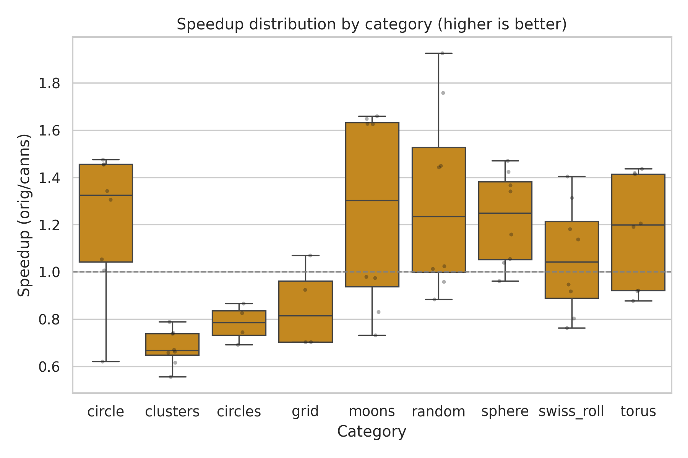
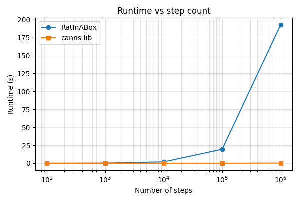
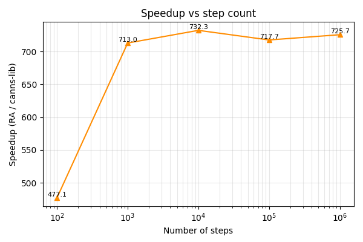

# canns-lib

[](https://github.com/Routhleck/canns-lib/actions)
[](https://badge.fury.io/py/canns-lib)
[](https://opensource.org/licenses/Apache-2.0)
[](https://github.com/routhleck/canns-lib)

[](https://github.com/routhleck/canns-lib)

<picture></picture>
<picture></picture>
[](https://doi.org/10.5281/zenodo.17412545)

<picture></picture>
[](https://pepy.tech/projects/canns-lib)
[](https://deepwiki.com/Routhleck/canns-lib)
[](https://buymeacoffee.com/forrestcai6)

High-performance computational acceleration library for [CANNs](https://github.com/Routhleck/canns) (Continuous Attractor Neural Networks), providing optimized Rust implementations for computationally intensive tasks in neuroscience and topological data analysis.

## Overview

canns-lib is a modular library designed to provide high-performance computational backends for the CANNS Python package. It currently includes the Ripser module for topological data analysis, with plans for additional modules covering approximate nearest neighbors, dynamics computation, and other performance-critical operations.

## Modules

### 🔬 Ripser - Topological Data Analysis

High-performance implementation of the Ripser algorithm for computing Vietoris-Rips persistence barcodes.

#### Performance Highlights

- **Mean speedup**: 1.13x across 54 benchmarks vs ripser.py
- **Peak speedup**: Up to 1.82x on certain datasets
- **Memory efficiency**: 1.01x memory ratio (stable usage)
- **Perfect accuracy**: 100% match with ripser.py results



#### Top Performing Scenarios
| Dataset Type | Configuration | Speedup |
|--------------|--------------|---------|
| Random N(0,I) | d=2, n=500, maxdim=2 | **1.82x** |
| Two moons | n=400, noise=0.08, maxdim=2 | **1.77x** |
| Random N(0,I) | d=2, n=200, maxdim=2 | **1.72x** |

#### Features

- **Algorithmic improvements**: Row-by-row edge generation, binary search for sparse matrices
- **Memory optimization**: Structure-of-Arrays layout, intelligent buffer reuse
- **Parallel processing**: Multi-threading with Rayon (enabled by default)
- **Full Compatibility**: Drop-in replacement for ripser.py with identical API
- **Multiple Metrics**: Support for Euclidean, Manhattan, Cosine, and custom distance metrics
- **Sparse Matrices**: Efficient handling of sparse distance matrices
- **Cocycle Computation**: Optional computation of representative cocycles

### 🧭 Spatial Navigation (RatInABox parity)

Accelerated reimplementation of RatInABox environments and agents with PyO3/
Rust. Supports solid and periodic boundaries, arbitrary polygons, holes, and
thigmotaxis wall-following.

#### Performance Snapshot

The spatial backend delivers ~700× runtime speedups vs. the pure-Python
reference when integrating long trajectories.  Benchmarked with
`benchmarks/spatial/step_scaling_benchmark.py` (`dt=0.02`, repeats=1).

| Steps | RatInABox Runtime | canns-lib Runtime | Speedup |
|------:|------------------:|------------------:|--------:|
| 10²   | 0.020 s | <0.001 s | 477× |
| 10³   | 0.190 s | <0.001 s | 713× |
| 10⁴   | 1.928 s | 0.003 s | 732× |
| 10⁵   | 19.481 s | 0.027 s | 718× |
| 10⁶   | 192.775 s | 0.266 s | 726× |





Plots and CSV summaries are emitted to `benchmarks/spatial/outputs/`.

#### Highlights

- **Full parity** with RatInABox API (Environment, Agent, trajectory import/export)
- **Polygon & hole support** with adaptive projection and wall vectors
- **Parity comparison tools** in `example/trajectory_comparison.py`
- **Visualization utilities**: drop-in replacements for RatInABox's plotting
  helpers (trajectory, heatmaps, histograms)
- **Benchmark scripts** for long-step drift and speedup under
  `benchmarks/spatial/`

#### Visualization Helpers

```python
from canns_lib import spatial

env = spatial.Environment(dimensionality="2D", boundary_conditions="solid")
agent = spatial.Agent(env, rng_seed=2025)

for _ in range(2_000):
    agent.update(dt=0.02)

# Trajectory with RatInABox-style colour fading and agent marker
agent.plot_trajectory(color="changing", colorbar=True)

# Other helpers mirror RatInABox naming
agent.plot_position_heatmap()
agent.plot_histogram_of_speeds()
agent.plot_histogram_of_rotational_velocities()
```

See `example/spatial_plotting_demo.py` for a full script that produces the
trajectory, heatmap, and histogram figures showcased above.

### 🚀 Coming Soon

- **Dynamics**: High-performance dynamics computation for neural networks
- And more...

## Installation

### From PyPI (Recommended)
```bash
pip install canns-lib
```

### From Source
```bash
git clone https://github.com/Routhleck/canns-lib.git
cd canns-lib
pip install maturin
maturin develop --release
```

## Quick Start

### Using the Ripser Module

```python
import numpy as np
from canns_lib.ripser import ripser

# Generate sample data
data = np.random.rand(100, 3)

# Compute persistence diagrams
result = ripser(data, maxdim=2)
diagrams = result['dgms']

print(f"H0: {len(diagrams[0])} features")
print(f"H1: {len(diagrams[1])} features")
print(f"H2: {len(diagrams[2])} features")
```

### Advanced Options

```python
# High-performance computation with progress tracking
result = ripser(
    data,
    maxdim=2,
    thresh=1.0,                    # Distance threshold
    coeff=2,                       # Coefficient field Z/2Z
    do_cocycles=True,              # Compute representative cycles
    verbose=True,                  # Detailed output
    progress_bar=True,             # Show progress
    progress_update_interval=1.0   # Update every second
)

# Access results
diagrams = result['dgms']          # Persistence diagrams
cocycles = result['cocycles']      # Representative cocycles
num_edges = result['num_edges']    # Number of edges in complex
```

### Sparse Matrix Support

```python
from scipy import sparse

# Create sparse distance matrix
row = [0, 1, 2]
col = [1, 2, 0]
data = [1.0, 1.5, 2.0]
sparse_dm = sparse.coo_matrix((data, (row, col)), shape=(3, 3))

# Compute with sparse matrix (automatically detected)
result = ripser(sparse_dm, distance_matrix=True, maxdim=1)
```

## Compatibility

The ripser module maintains 100% API compatibility with ripser.py:

```python
# These work identically
import ripser as original_ripser
from canns_lib.ripser import ripser

result1 = original_ripser.ripser(data, maxdim=2)
result2 = ripser(data, maxdim=2)

# Results are numerically identical
assert np.allclose(result1['dgms'][0], result2['dgms'][0])
```

## Development

### Building from Source

```bash
# Prerequisites
curl --proto '=https' --tlsv1.2 -sSf https://sh.rustup.rs | sh
pip install maturin

# Build and install
git clone https://github.com/Routhleck/canns-lib.git
cd canns-lib
maturin develop --release --features parallel

# Run tests
python -m pytest tests/ -v
```

### Running Benchmarks

```bash
cd benchmarks
python compare_ripser.py --n-points 100 --maxdim 2 --trials 5
```

## Technical Details

### Ripser Module Architecture

- **Dual API paths**: High-performance versions and full-featured versions with progress tracking
- **Memory optimization**: Structure-of-Arrays layout, intelligent buffer reuse
- **Sparse matrix support**: Efficient handling via neighbor intersection algorithms
- **Progress tracking**: Built-in progress bars using tqdm when available
- **Parallel processing**: Multi-threading with Rayon

### Algorithmic Optimizations

- **Dense edge enumeration**: O(n²) row-by-row generation vs O(n³) vertex decoding
- **Sparse queries**: O(log k) binary search vs O(k) linear scan
- **Cache-friendly data structures**: SoA matrix layout, k-major binomial tables
- **Zero-apparent pairs**: Skip redundant column reductions in higher dimensions

## License

Licensed under the Apache License, Version 2.0. See [LICENSE](LICENSE) for details.

## Citation

If you use canns-lib in your research, please cite:

```bibtex
@software{canns_lib,
  title={canns-lib: High-Performance Computational Acceleration Library for CANNS},
  author={He, Sichao},
  url={https://github.com/Routhleck/canns-lib},
  year={2025}
}
```

## Acknowledgments

### Ripser Module
- **Ulrich Bauer**: Original Ripser algorithm and C++ implementation
- **Christopher Tralie & Nathaniel Saul**: ripser.py Python implementation
- **Rust community**: Amazing ecosystem of high-performance libraries

## Related Projects

- [Ripser](https://github.com/Ripser/ripser): Original C++ implementation
- [ripser.py](https://github.com/scikit-tda/ripser.py): Python bindings for Ripser
- [CANNS](https://github.com/Routhleck/canns): Continuous Attractor Neural Networks
- [scikit-tda](https://github.com/scikit-tda): Topological Data Analysis in Python
